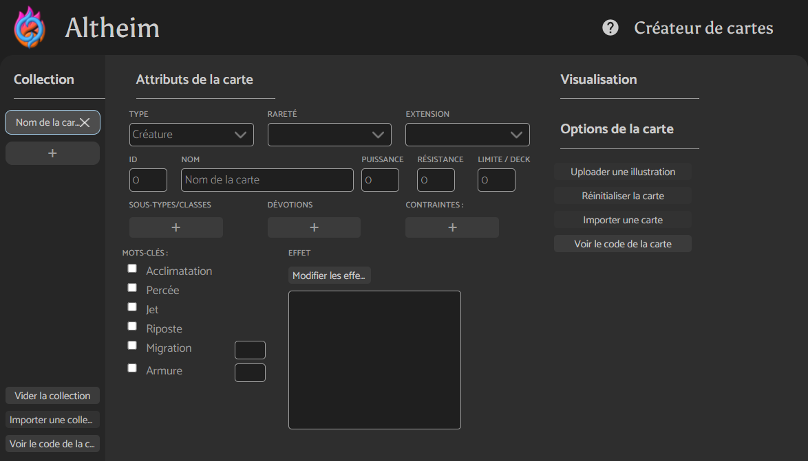

# Comment utiliser le créateur de carte ?

# Les fondamentaux

## La collection

La colonne de gauche est la collection. Elle contient toutes les cartes que vous avez créées durant cette session. Vous pouvez ajouter (bouton `+` ) et supprimer (bouton `×` ) des cartes. Pour naviguer entre les cartes, il suffit de cliquer dessus.

Les cartes stockées dans la collection ne sont pas sauvegardées (pour l'instant), donc ne quittez pas le site avant d'avoir exporté ou copié le code de la collection que vous avez créée !

Pour exporter l'ensemble des cartes de la collection, survolez le bouton `Voir le code de la collection`. Vous avez ainsi accès à un aperçu du code correspondant, que vous pouvez copier ou exporter dans un fichier. 

## Attributs de la carte

La partie centrale de la page permet de modifier la carte sélectionnée dans la collection. Pour les `Sous-types`, `Devotions` et `Contraintes`, il faut en ajouter un par champ de texte (ajoutez en autant que vous voulez avec les boutons `+`.

## Visualisation

À venir...

Vous pouvez visualiser la carte que vous êtes en train de créer comme elle sera affichée dans le jeu.

## Options de la carte

De la même manière que pour la collection, vous pouvez voir, copier et exporter le code pour une carte individuelle avec le bouton `Voir le code de la carte`.

# Les effets

Les effets doivent être décrit deux fois dans les attributs de la carte : 

- dans le champ de texte : ce texte sera affiché sur la carte dans le jeu pour décrire l'effet aux joueurs
- dans le popup de modification des effets accessible grâce au bouton `Modifier les effet` pour décrire l'effet au jeu