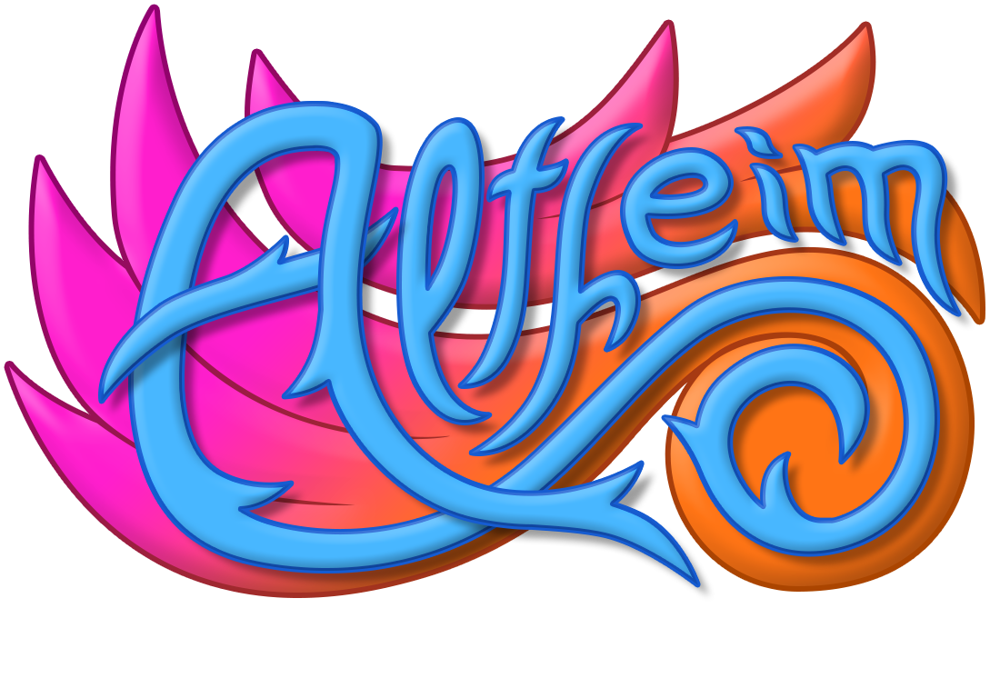

# Créateur de cartes Altheim

Une appli Dart Web pour génerer le code JSON correspondant à une carte,
 une collection ou un deck du jeu _Altheim : Artisans des mondes_.
 
 Résultat disponible 
 [ici](https://www.etud.insa-toulouse.fr/~ysimard/altheim/).
 
